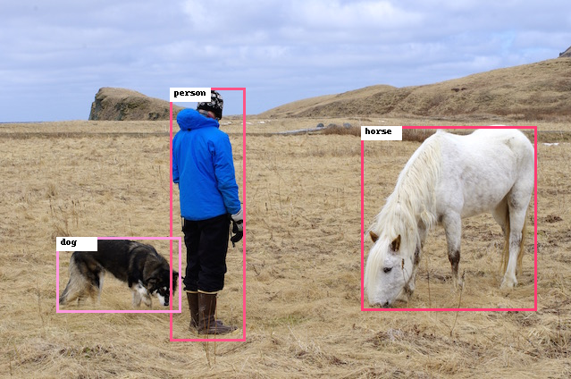

# Caffe YOLOv3 Object Detection

Please open the `jupyter-notebook` for a quick demo |[Original Github Repository](https://github.com/ChenYingpeng/caffe-yolov3)|

> 📌 **Note:** This repository allows you to run inference with using Caffe based YOLOv4 model.


## Overview

`YOLOv3` A real-time object detection framework of Yolov3 based on Caffe. Before `YOLOv5`, `YOLOv3` was very popular and widely used repository.



## Getting Started

Download appropriate **YOLOv3 model** from the following link and put it in the _model_ folder. 

| **Model** | **CANN Version** | **How to Obtain** |
|---|---|---|
| YOLOv3 | 5.1.RC2 | Download pretrained model [YOLOv3](https://obs-9be7.obs.cn-east-2.myhuaweicloud.com/003_Atc_Models/AE/ATC%20Model/Yolov3/yolov3.caffemodel) |


<details> <summary> Work on docker environment (<i>click to expand</i>)</summary>

Start your docker environment.

```bash
sudo docker run -it -u root --rm --name yolov3 -p 6565:4545 \
--device=/dev/davinci0 \
--device=/dev/davinci_manager \
--device=/dev/devmm_svm \
--device=/dev/hisi_hdc \
-v /usr/local/dcmi:/usr/local/dcmi \
-v /usr/local/bin/npu-smi:/usr/local/bin/npu-smi \
-v /usr/local/Ascend/driver:/usr/local/Ascend/driver \
-v /PATH/pyacl_samples:/workspace/pyacl_samples \
ascendhub.huawei.com/public-ascendhub/infer-modelzoo:22.0.RC2 /bin/bash
```
    
```bash
apt-get update && apt-get install -y --no-install-recommends \
        gcc \
        g++ \
        make \
        cmake \
        zlib1g \
        zlib1g-dev \
        openssl \
        libsqlite3-dev \
        libssl-dev \
        libffi-dev \
        unzip \
        pciutils \
        net-tools \
        libblas-dev \
        gfortran \
        libblas3 \
        libopenblas-dev \
        libbz2-dev \
        build-essential \
        lzma \
        liblzma-dev \
        git \
        && \
    apt-get clean && \
    rm -rf /var/lib/apt/lists/*
```
    
```bash
rm -rf /usr/local/python3.9.2

wget https://www.python.org/ftp/python/3.7.5/Python-3.7.5.tgz --no-check-certificate && \
    tar -zxvf Python-3.7.5.tgz && \
    cd Python-3.7.5 && \
    ./configure --prefix=/usr/local/python3.7.5 --enable-loadable-sqlite-extensions --enable-shared && make -j && make install && \
    cd .. && \
    rm -r -d Python-3.7.5 && rm Python-3.7.5.tgz && \
    export LD_LIBRARY_PATH=/usr/local/python3.7.5/lib:$LD_LIBRARY_PATH && \
    export PATH=/usr/local/python3.7.5/bin:$PATH

pip3 install --upgrade pip
pip3 install attrs numpy decorator sympy cffi pyyaml pathlib2 psutil protobuf scipy requests absl-py jupyter jupyterlab sympy

```
</details>


## Convert Your Model

#### CAFFE model -> Ascend OM format
For this stages it is recommended to use the docker environment to avoid affecting the development environment. The `model_download.sh` file will do model downloading stage automatically. After you should have the `.caffe` model in your model path. 

```bash
cd <root_path_of_pyacl_samples>/pyacl_samples/Caffe/YoloV3/model
bash model_download.sh
```

```bash
atc --model=./yolov3.prototxt \
    --weight=./yolov3.caffemodel \
    --framework=0 \
    --output=./yolov3_caffe_416_no_csc \
    --soc_version=Ascend310 \
    --insert_op_conf=./aipp_yolov3_416_no_csc.cfg

```

Install dependencies;

- numpy
- opencv_python

```
pip3 install -r requirements.txt
```

Finaly, open `jupyter-notebook` and run the code for demo

```bash
jupyter-notebook --port 4545 --ip 0.0.0.0 --no-browser --allow-root
```

Jupyter-notebook will open in (localhost):6565