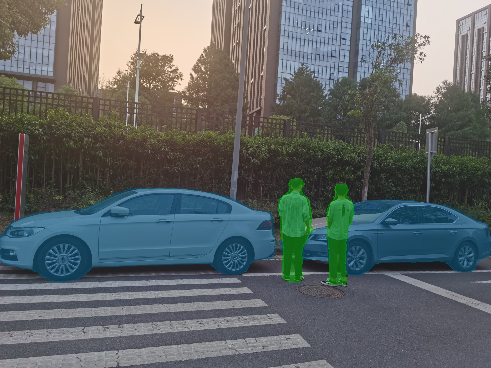

# MindSpore DeepLabv3

Please open the `jupyter-notebook` for a quick demo |[Original Github Repository](https://github.com/open-mmlab/mmsegmentation)


## Overview

`DeepLabv3` is a semantic segmentation architecture that improves upon DeepLabv2 with several modifications. To handle the problem of segmenting objects at multiple scales, modules are designed which employ atrous convolution in cascade or in parallel to capture multi-scale context by adopting multiple atrous rates. 





## Getting Started

Download appropriate **DeepLabv3 model** from the following link and put it in the _model_ folder. 

| **Model** | **CANN Version** | **How to Obtain** |
|---|---|---|
| DeepLabv3 | 5.1.RC2 | Download pretrained model [DeepLabv3](https://obs-9be7.obs.cn-east-2.myhuaweicloud.com/003_Atc_Models/AE/ATC%20Model/deeplabv3/deeplabv3_origin.air) |


<details> <summary> Work on docker environment (<i>click to expand</i>)</summary>

Start your docker environment.

```bash
sudo docker run -it -u root --rm --name mindspore_deeplabv3 -p 6565:4545 \
--device=/dev/davinci0 \
--device=/dev/davinci_manager \
--device=/dev/devmm_svm \
--device=/dev/hisi_hdc \
-v /usr/local/dcmi:/usr/local/dcmi \
-v /PATH/pyacl_samples:/workspace/pyacl_samples \
-v /usr/local/bin/npu-smi:/usr/local/bin/npu-smi \
-v /usr/local/Ascend/driver:/usr/local/Ascend/driver \
ascendhub.huawei.com/public-ascendhub/infer-modelzoo:22.0.RC2 /bin/bash
```
    
```bash
pip3 install --upgrade pip
pip3 install attrs numpy decorator sympy cffi pyyaml pathlib2 psutil protobuf scipy requests absl-py jupyter jupyterlab sympy
```
    
```bash
apt-get update && apt-get install -y --no-install-recommends \
        gcc \
        g++ \
        make \
        cmake \
        zlib1g \
        zlib1g-dev \
        openssl \
        libsqlite3-dev \
        libssl-dev \
        libffi-dev \
        unzip \
        pciutils \
        net-tools \
        libblas-dev \
        gfortran \
        libblas3 \
        libopenblas-dev \
        libbz2-dev \
        build-essential \
        git \
        && \
    apt-get clean && \
    rm -rf /var/lib/apt/lists/*
```
</details>


## Convert Your Model

## AIR format -> OM format:
For this stages it is recommended to use the docker environment to avoid affecting the development environment. After downloading the pretrained model, you should have the `.air` model in your `model` path. Below atc commmand will do model conversion stage from `.air` to `.om` automatically.

```bash
atc --model=deeplabv3_origin.air \
    --framework=1 \
    --output=deeplab_513 \
    --soc_version=Ascend310
```


Install dependencies;

- matplotlib
- numpy
- opencv_python

```
pip3 install -r requirements.txt
```

Finaly, open `jupyter-notebook` and run the code for demo

```bash
jupyter-notebook --port 4545 --ip 0.0.0.0 --no-browser --allow-root
```

Jupyter-notebook will open in (localhost):6565