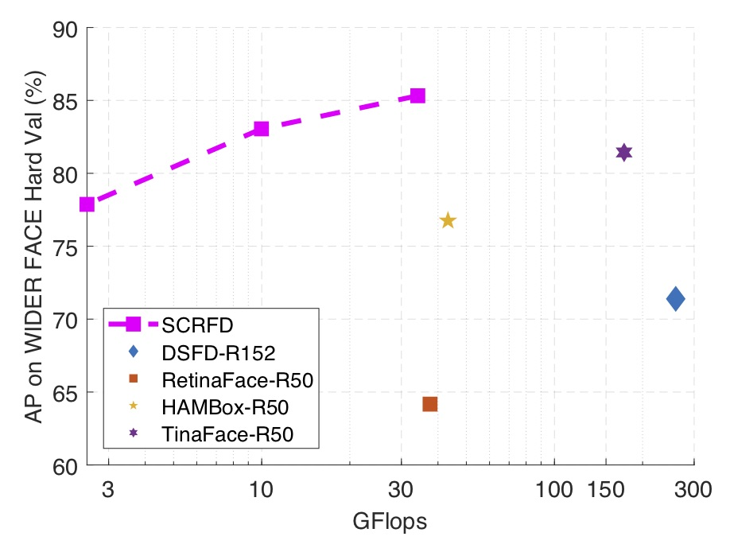

# InsightFace : SCRFD Face Detection

Please open the `jupyter-notebook` for a quick demo | [Paper](https://arxiv.org/abs/2105.04714) | [Original Github Repository](https://github.com/deepinsight/insightface/tree/master/detection/scrfd)

<div align="left">
  
</div>

## Overview
`SCRFD` is an efficient high accuracy face detection approach which 



## Getting started

Download following **SCRFD PT model** from the link and put it in the _model_ folder by changing its name as **scrfd_34g**. 

| **Model** | **CANN Version** | **How to Obtain** |
|---|---|---|
| SCRFD | 5.1.RC2  | Download pretrained model [SCRFD_34G](https://onedrive.live.com/?authkey=%21AJnAV5tWWaU6%5FPM&id=4A83B6B633B029CC%215538&cid=4A83B6B633B029CC)

<details> <summary> Working on docker environment (<i>click to expand</i>)</summary>

Start your docker environment.

```bash
sudo docker run -it -u root --rm --name insightface -p 6565:4545 \
--device=/dev/davinci0 \
--device=/dev/davinci_manager \
--device=/dev/devmm_svm \
--device=/dev/hisi_hdc \
-v /usr/local/dcmi:/usr/local/dcmi \
-v /usr/local/bin/npu-smi:/usr/local/bin/npu-smi \
-v /usr/local/Ascend/driver:/usr/local/Ascend/driver \
-v /PATH/pyacl_samples:/workspace/pyacl_samples \
ascendhub.huawei.com/public-ascendhub/infer-modelzoo:22.0.RC2 /bin/bash
```
    
```bash
apt-get update && apt-get install -y --no-install-recommends \
        gcc \
        g++ \
        make \
        cmake \
        zlib1g \
        zlib1g-dev \
        openssl \
        libsqlite3-dev \
        libssl-dev \
        libffi-dev \
        unzip \
        pciutils \
        net-tools \
        libblas-dev \
        gfortran \
        libblas3 \
        libopenblas-dev \
        libbz2-dev \
        build-essential \
        lzma \
        liblzma-dev \
        git \
        && \
    apt-get clean && \
    rm -rf /var/lib/apt/lists/*
```
    
```bash
rm -rf /usr/local/python3.9.2

wget https://www.python.org/ftp/python/3.7.5/Python-3.7.5.tgz --no-check-certificate && \
    tar -zxvf Python-3.7.5.tgz && \
    cd Python-3.7.5 && \
    ./configure --prefix=/usr/local/python3.7.5 --enable-loadable-sqlite-extensions --enable-shared && make -j && make install && \
    cd .. && \
    rm -r -d Python-3.7.5 && rm Python-3.7.5.tgz && \
    export LD_LIBRARY_PATH=/usr/local/python3.7.5/lib:$LD_LIBRARY_PATH && \
    export PATH=/usr/local/python3.7.5/bin:$PATH

pip3 install --upgrade pip
pip3 install attrs numpy decorator sympy cffi pyyaml pathlib2 psutil protobuf scipy requests absl-py jupyter jupyterlab sympy

```


</details>

## Convert Your Model

### PT model -> ONNX format -> Ascend om format

For this stages it is recommended to use the docker environment to avoid affecting the development environment. The `model_convert.sh` file will do model conversion stage automatically. After conversion you should have the **.onnx** model in your `model` path.

```bash
cd <root_path_of_pyacl_samples>/pyacl_samples/PyTorch/InsightFace/model

bash model_convert.sh
```

```bash
atc --model=scrfd_34g_shape640x640.onnx \
    --framework=5 \
    --output=scrfd_34g \
    --soc_version=Ascend310 \
    --precision_mode=allow_fp32_to_fp16
```

Install dependencies;
- opencv-python-headless
- numpy
- Pillow

```
pip3 install -r requirements.txt
```

Finaly, open `jupyter-notebook` and run the code for demo

```bash
jupyter-notebook --port 4545 --ip 0.0.0.0 --no-browser --allow-root
```

Jupyter-notebook will open in (localhost):6565

## Citation
```
@article{guo2021sample,
  title={Sample and Computation Redistribution for Efficient Face Detection},
  author={Guo, Jia and Deng, Jiankang and Lattas, Alexandros and Zafeiriou, Stefanos},
  journal={arXiv preprint arXiv:2105.04714},
  year={2021}
}
```